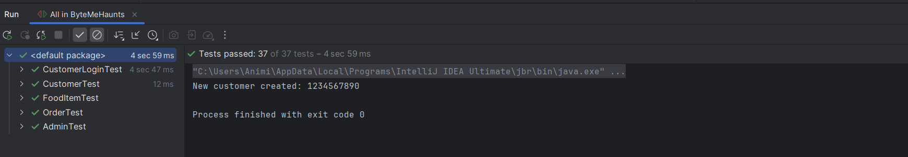

# Byte Me! Food Ordering System - README

## Project Overview
The **Byte Me! Food Ordering System** is a complete Java-based application designed to facilitate and manage food ordering in a college canteen. This system features a **fully functional Command-Line Interface (CLI)** and a **comprehensive Swing-based Graphical User Interface (GUI)** that mirrors all CLI features. It also incorporates efficient file handling using I/O streams and rigorous testing with JUnit. Built with extensibility in mind, the application adheres to object-oriented programming principles.

- For Advanced Programming Practices (CSE201) course assignment 04 weighing 5%.
- By Animish Yadav (2023089)
---

## Features

### **1. Command-Line Interface (CLI)**
The CLI provides robust functionality for both users and admins:
- **Menu Management (Admin):**
    - Add, remove, or modify menu items.
    - Update item availability and prices.
- **Order Management:**
    - Place, modify, or cancel orders.
    - Update and track order statuses (e.g., preparing, out for delivery).
- **User Management:**
    - Register new users and authenticate existing users.
    - Retrieve and display user-specific order histories.
- **Cart Operations:**
    - Add, update, or remove items from the cart with real-time price updates.
    - Prevent invalid operations such as setting negative item quantities.

---

### **2. Graphical User Interface (GUI)**
The Swing-based GUI is **fully functional**, providing a user-friendly experience with all the features of the CLI. It ensures seamless interaction while maintaining data consistency. Key features include:

#### **Menu Screen**
- Displays the complete canteen menu with details such as item name, price, and availability.
- Uses a `JTable` for structured and visually clear presentation.
- Includes interactive buttons for easy navigation.

#### **Order Management**
- Allows users to place, view, and manage their orders.
- Displays order statuses and detailed order breakdowns.
- Admins can update order statuses and track progress.

#### **User Management**
- Enables user login, registration, and retrieval of order histories directly through the GUI.

#### **Cart Operations**
- Fully interactive cart management, including:
    - Adding items.
    - Modifying quantities.
    - Removing items with real-time updates to the total cost.

#### **Design and Navigation**
- Built with `JFrame`, `JPanel`, `JTable`, and `JButton` for a responsive and modern interface.
- Clear navigation between menu, cart, and order screens using buttons.
- Ensures data consistency by integrating I/O stream handling.

> **Note:** While the GUI provides full functionality, it works seamlessly with CLI operations. Both interfaces share the same underlying data and logic.

---

### **3. I/O Stream File Management**
The application uses file handling to ensure persistent and reliable data management:
- **User Data Management:**
    - Handles user login and registration via file storage.
    - Reads existing user data and appends new registrations.
- **Order History Management:**
    - Stores detailed order histories for each user, including items, quantities, and prices.
- **Cart Persistence:**
    - Maintains cart data in real-time during sessions, ensuring updates are reflected accurately.

---

### **4. JUnit Testing**
The project includes **37 comprehensive JUnit test cases** to validate system behavior. Key scenarios include:
- **Out-of-Stock Orders:**
    - Tests the system’s ability to prevent users from ordering unavailable items.
- **Invalid Login Attempts:**
    - Simulates incorrect credentials and ensures proper error handling.
- **Cart Operations:**
    - Verifies adding items, modifying quantities, and preventing invalid operations such as negative values.

---

## Prerequisites
- **Java Development Kit (JDK) 8+**
- **Swing library (built into Java SE)**
- **JUnit 5 for testing**

---

## Project Structure
- **src/main/java**: Contains the application source code, including CLI and GUI implementations.
- **src/test/java**: Contains JUnit test cases.
- **resources**: Includes data files for users, orders, and temporary cart storage.

---
